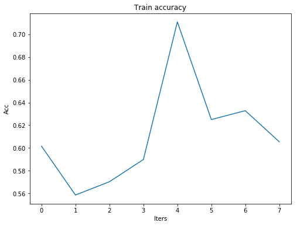

# Create Convolutional Neural Networks in tensorflow with ease
With this library **cnn_modeling.py** you can create "n" layers of convolutional neural networks **(CNN)** very quickly.  You just need to creat a dictionary for every layer with its hyperparameters and add them to a list. Afterwards use this list as input of the library to create a graph.
## Features/Constraints:
* All the activation functions are ReLU
* Enable/Disable Batch normalization before ReLU activation for every layer.
* Enable/Disable max pooling 
* Stack convolutional layers
* Stack Fully connected  layers 
* Save/restore the model to a given file name
* Get the training/test scores.
* Get the Weights and biases after training/testing 
* Mini-batch processing.
* Enable/Disable dropout for the Fully connected layers. (Keep_ prob is set to one during the test time)
* Adam optimizer used.
* An additional function to transform a numpy array with shape **m** by **n+1** to a mini-batch list of the desired size with balanced clases. But, **Important constrain:** for binary classification only. (This constrain is only for this last additional function).

### Future improvements:
* Exponential weighted average for batch mean/std for the testing time.
* Predictions for a single example or batch/mini-batch input.
	
## Demo:
```python
import matplotlib.pyplot as plt
import numpy as np
import tensorflow as tf
import pandas as pd
import cnn_modeling 
import imp
imp.reload(cnn_modeling)
```


    <module 'cnn_modeling' from '/home/.../cnn_modeling.py'>


```python
numpy_dir = "NumpyData/"
complete_train = numpy_dir+'images_complete_train_256x256_7494.npy'
complete_test = numpy_dir+'images_complete_test_256x256_4394.npy'
```


```python
help(cnn_modeling)
```

    Help on module cnn_modeling:
    
    NAME
        cnn_modeling
    
    FUNCTIONS
        balance_positive_negative(iNp, iBatchSize=256, v=False)
        
        create_conv(iDic, input_layer, iName, prev_dic, stddev_n=0.1, norm_offset=0, norm_scale=1, norm_epsilon=1e-06)
        
        create_graph(train_batch, layers, test_batch=None, width=256, height=256, batch_proc=True, test_batch_bool=False, restore_session=False, save_model=False, only_feed_forward=False, stddev_n=0.1, learning_rate=0.0001, iters=4, model_file='CNN_model')
        
        get_previous_features(i_layer)
        
        plot_list(iList, figsize=(10, 8), title='Loss/Eff', xlabel='Iters', ylabel='Loss/Eff')
    
    FILE
        /home/.../cnn_modeling.py

Here we transform a nmpy array with the shape **m** x **n+1**. m rows as examples and n features +1 column for the class. We create balanced batches with the size **iBatchsize=256**, with 128 positive (1) and 128 negative (0). 
```python
train_numpy = np.load(complete_train)
train_batch = cnn_modeling.balance_positive_negative(iNp=train_numpy,iBatchSize=256)
print("Done",len(train_batch))
```
    Done 19

```python
test_numpy = np.load(complete_test)
test_batch = cnn_modeling.balance_positive_negative(iNp=test_numpy,iBatchSize=256)
print("Done",len(test_batch))
```

    Done 15


For this demo we will take just 3 mini-batches from the train and test sets.
```python
mini_train_batch = train_batch[:4]
mini_test_batch = test_batch[:4]
print(len(mini_train_batch),len(mini_test_batch))
```

    4 4


## Testing a feed forward without mini-batch

We make this test first to evaluate if the graph is created without errors


```python
CV1 = { 'type':'CV', 'depth':8, 'filter_w':11, 'filter_stride':[1,2,2,1], 'norm_bool':True,
    'max_pooling':True, 'max_pool_mask':[1,3,3,1], 'max_pool_stride':[1,1,1,1], 'padding':'SAME',
       'name':'CV1'} 

CV2 ={'type':'CV',  'depth':8, 'filter_w':11, 'filter_stride':[1,2,2,1], 'norm_bool':True,
      'max_pooling':True, 'max_pool_mask':[1,3,3,1], 'max_pool_stride':[1,1,1,1], 'padding':'SAME',
      'name':'CV2' } 

CV2FC={'type':'CV2FC', 'neurons':1024, 'norm_bool':True, 'name':'CV2FC'} 
FC1 = { 'type':'FC', 'neurons':1024, 'norm_bool':True, 'name':'FC1'} 
FC2 = { 'type':'FC', 'neurons':1024, 'norm_bool':True, 'name':'FC2',
       'drop_out_bool':True, 'keep_prob_train':0.5} 

layers = [CV1,CV2,CV2FC,FC1,FC2]


stats_dic = cnn_modeling.create_graph(mini_train_batch,layers=layers,test_batch=mini_test_batch,
            width=256,height=256, 
             batch_proc=False, 
            test_batch_bool=False, 
            only_feed_forward=True,
             restore_session = False, save_model = False, 
             stddev_n = 0.1, learning_rate = 1e-4,iters=1,model_file='test_model')
```

    Creating layer: CV1
    Creating layer: CV2
    Creating layer: CV2FC
    Creating layer: FC1
    Creating layer: FC2
    Starting session
    CV1 max (256, 128, 128, 8)
    CV2 max (256, 64, 64, 8)
    CV2FC relu (256, 1024)
    FC1 relu (256, 1024)
    FC2 dropout (256, 1024)
    First batch test  Loss: 0.870873 Accuracy: 0.570312
    Loss: 0.700965 Accuracy: 0.6875
    Done


## Testing a feed forward with mini-batch processing 

As the previous test, we evaluate here if our batch processing is done correctly


```python
CV1 = { 'type':'CV', 'depth':8, 'filter_w':11, 'filter_stride':[1,2,2,1], 'norm_bool':True,
    'max_pooling':True, 'max_pool_mask':[1,3,3,1], 'max_pool_stride':[1,1,1,1], 'padding':'SAME',
       'name':'CV1'} 

CV2 ={'type':'CV',  'depth':8, 'filter_w':11, 'filter_stride':[1,2,2,1], 'norm_bool':True,
      'max_pooling':True, 'max_pool_mask':[1,3,3,1], 'max_pool_stride':[1,1,1,1], 'padding':'SAME',
      'name':'CV2' } 

CV2FC={'type':'CV2FC', 'neurons':1024, 'norm_bool':True, 'name':'CV2FC'} 
FC1 = { 'type':'FC', 'neurons':1024, 'norm_bool':True, 'name':'FC1'} 
FC2 = { 'type':'FC', 'neurons':1024, 'norm_bool':True, 'name':'FC2',
       'drop_out_bool':True, 'keep_prob_train':0.5} 

layers = [CV1,CV2,CV2FC,FC1,FC2]


stats_dic = cnn_modeling.create_graph(mini_train_batch,layers=layers,test_batch=mini_test_batch,
            width=256,height=256, 
             batch_proc=True, 
            test_batch_bool=False, 
            only_feed_forward=True,
             restore_session = False, save_model = False, 
             stddev_n = 0.1, learning_rate = 1e-4,iters=1,model_file='test_model')
```

    Creating layer: CV1
    Creating layer: CV2
    Creating layer: CV2FC
    Creating layer: FC1
    Creating layer: FC2
    Starting session
    CV1 max (256, 128, 128, 8)
    CV2 max (256, 64, 64, 8)
    CV2FC relu (256, 1024)
    FC1 relu (256, 1024)
    FC2 dropout (256, 1024)
    First batch test  Loss: 0.799795 Accuracy: 0.660156
    Evaluating using train batch
    batch: 0 Loss: 0.339041 Accuracy: 0.84375
    batch: 1 Loss: 0.931047 Accuracy: 0.609375
    batch: 2 Loss: 0.77167 Accuracy: 0.640625
    batch: 3 Loss: 0.698236 Accuracy: 0.671875
    Accuracy mean: 0.691406 max: 0.84375 min: 0.609375
    Done


## Start the training and saving the model for later training

For the first training we need to specify **save_model=True** but having **restore_session=False**. It is required to specify the file name where the model will be saved in by specifying the variable **model_file**. For this example we set up **2** iterations for the mini-batch training.


```python
CV1 = { 'type':'CV', 'depth':8, 'filter_w':11, 'filter_stride':[1,2,2,1], 'norm_bool':True,
    'max_pooling':True, 'max_pool_mask':[1,3,3,1], 'max_pool_stride':[1,1,1,1], 'padding':'SAME',
       'name':'CV1'} 

CV2 ={'type':'CV',  'depth':8, 'filter_w':11, 'filter_stride':[1,2,2,1], 'norm_bool':True,
      'max_pooling':True, 'max_pool_mask':[1,3,3,1], 'max_pool_stride':[1,1,1,1], 'padding':'SAME',
      'name':'CV2' } 

CV2FC={'type':'CV2FC', 'neurons':1024, 'norm_bool':True, 'name':'CV2FC'} 
FC1 = { 'type':'FC', 'neurons':1024, 'norm_bool':True, 'name':'FC1'} 
FC2 = { 'type':'FC', 'neurons':1024, 'norm_bool':True, 'name':'FC2',
       'drop_out_bool':True, 'keep_prob_train':0.5} 

layers = [CV1,CV2,CV2FC,FC1,FC2]


stats_dic = cnn_modeling.create_graph(mini_train_batch,layers=layers,test_batch=mini_test_batch,
            width=256,height=256, 
             batch_proc=True, 
            test_batch_bool=False, 
            only_feed_forward=False,
             restore_session = False, save_model = True, 
             stddev_n = 0.1, learning_rate = 1e-4,iters=2,model_file='test_model')
```

    Creating layer: CV1
    Creating layer: CV2
    Creating layer: CV2FC
    Creating layer: FC1
    Creating layer: FC2
    Starting session
    CV1 max (256, 128, 128, 8)
    CV2 max (256, 64, 64, 8)
    CV2FC relu (256, 1024)
    FC1 relu (256, 1024)
    FC2 dropout (256, 1024)
    First batch test  Loss: 2.66882 Accuracy: 0.5
    iter: 0 batch: 0 Loss: 1.72455 Accuracy: 0.601562
    iter: 0 batch: 1 Loss: 2.3825 Accuracy: 0.558594
    iter: 0 batch: 2 Loss: 2.53418 Accuracy: 0.570312
    iter: 0 batch: 3 Loss: 2.02975 Accuracy: 0.589844
    Train batch mean 0.580078 min: 0.558594 max 0.601562
    iter: 1 batch: 0 Loss: 1.21905 Accuracy: 0.710938
    iter: 1 batch: 1 Loss: 1.80638 Accuracy: 0.625
    iter: 1 batch: 2 Loss: 1.73706 Accuracy: 0.632812
    iter: 1 batch: 3 Loss: 1.67835 Accuracy: 0.605469
    Train batch mean 0.643555 min: 0.605469 max 0.710938
    Train last iter mean 0.643555 min: 0.605469 max 0.710938
    Saving model in: test_model
    Done


The function returns the value for the cross entropy and train accuracy during the training


```python
print(stats_dic.keys())
```

    dict_keys(['train_acc', 'train_cross'])


To visualize the progress it is possible to use the function output and use **cnn_modeling.plot_list** to plot it.


```python
cnn_modeling.plot_list(stats_dic['train_acc'], figsize=(8, 6), title='Train accuracy', xlabel='Iters', ylabel='Acc')
cnn_modeling.plot_list(stats_dic['train_cross'], figsize=(8, 6), title='Test Cross entropy', xlabel='Iters', ylabel='Loss')
```





## Restore the model and continue training

The only difference with the previous step is to set **restore_session=True**


```python
CV1 = { 'type':'CV', 'depth':8, 'filter_w':11, 'filter_stride':[1,2,2,1], 'norm_bool':True,
    'max_pooling':True, 'max_pool_mask':[1,3,3,1], 'max_pool_stride':[1,1,1,1], 'padding':'SAME',
       'name':'CV1'} 

CV2 ={'type':'CV',  'depth':8, 'filter_w':11, 'filter_stride':[1,2,2,1], 'norm_bool':True,
      'max_pooling':True, 'max_pool_mask':[1,3,3,1], 'max_pool_stride':[1,1,1,1], 'padding':'SAME',
      'name':'CV2' } 

CV2FC={'type':'CV2FC', 'neurons':1024, 'norm_bool':True, 'name':'CV2FC'} 
FC1 = { 'type':'FC', 'neurons':1024, 'norm_bool':True, 'name':'FC1'} 
FC2 = { 'type':'FC', 'neurons':1024, 'norm_bool':True, 'name':'FC2',
       'drop_out_bool':True, 'keep_prob_train':0.5} 

layers = [CV1,CV2,CV2FC,FC1,FC2]


stats_dic_restore = cnn_modeling.create_graph(mini_train_batch,layers=layers,test_batch=mini_test_batch,
            width=256,height=256, 
             batch_proc=True, 
            test_batch_bool=False, 
            only_feed_forward=False,
             restore_session = True, save_model = True, 
             stddev_n = 0.1, learning_rate = 1e-4,iters=2,model_file='test_model')
```

    Creating layer: CV1
    Creating layer: CV2
    Creating layer: CV2FC
    Creating layer: FC1
    Creating layer: FC2
    Starting session
    INFO:tensorflow:Restoring parameters from ./test_model
    CV1 max (256, 128, 128, 8)
    CV2 max (256, 64, 64, 8)
    CV2FC relu (256, 1024)
    FC1 relu (256, 1024)
    FC2 dropout (256, 1024)
    First batch test  Loss: 0.574261 Accuracy: 0.785156
    iter: 0 batch: 0 Loss: 0.621952 Accuracy: 0.800781
    iter: 0 batch: 1 Loss: 1.17566 Accuracy: 0.667969
    iter: 0 batch: 2 Loss: 1.31136 Accuracy: 0.648438
    iter: 0 batch: 3 Loss: 1.08492 Accuracy: 0.683594
    Train batch mean 0.700195 min: 0.648438 max 0.800781
    iter: 1 batch: 0 Loss: 0.449774 Accuracy: 0.824219
    iter: 1 batch: 1 Loss: 0.981902 Accuracy: 0.726562
    iter: 1 batch: 2 Loss: 0.920269 Accuracy: 0.757812
    iter: 1 batch: 3 Loss: 0.740904 Accuracy: 0.75
    Train batch mean 0.764648 min: 0.726562 max 0.824219
    Train last iter mean 0.764648 min: 0.726562 max 0.824219
    Saving model in: test_model
    Done


Add the previous stats to the new one


```python
print(len(stats_dic_restore['train_acc']))
stats_dic_restore['train_acc'].extend(stats_dic['train_acc'])
stats_dic_restore['train_cross'].extend(stats_dic['train_acc'])
print(len(stats_dic_restore['train_acc']))
```

    8
    16


Visualize the result


```python
cnn_modeling.plot_list(stats_dic_restore['train_acc'], figsize=(8, 6), title='Train accuracy', xlabel='Iters', ylabel='Acc')
cnn_modeling.plot_list(stats_dic_restore['train_cross'], figsize=(8, 6), title='Test Cross entropy', xlabel='Iters', ylabel='Loss')
```


## Restore the trained model and test it in the dev/test mini-batch set 

Use the previous setting but change **test_batch_bool=True**, **save_model=False** and **only_feed_forward=True**


```python
CV1 = { 'type':'CV', 'depth':8, 'filter_w':11, 'filter_stride':[1,2,2,1], 'norm_bool':True,
    'max_pooling':True, 'max_pool_mask':[1,3,3,1], 'max_pool_stride':[1,1,1,1], 'padding':'SAME',
       'name':'CV1'} 

CV2 ={'type':'CV',  'depth':8, 'filter_w':11, 'filter_stride':[1,2,2,1], 'norm_bool':True,
      'max_pooling':True, 'max_pool_mask':[1,3,3,1], 'max_pool_stride':[1,1,1,1], 'padding':'SAME',
      'name':'CV2' } 

CV2FC={'type':'CV2FC', 'neurons':1024, 'norm_bool':True, 'name':'CV2FC'} 
FC1 = { 'type':'FC', 'neurons':1024, 'norm_bool':True, 'name':'FC1'} 
FC2 = { 'type':'FC', 'neurons':1024, 'norm_bool':True, 'name':'FC2',
       'drop_out_bool':True, 'keep_prob_train':0.5} 

layers = [CV1,CV2,CV2FC,FC1,FC2]


stats_dic_restore = cnn_modeling.create_graph(mini_train_batch,layers=layers,test_batch=mini_test_batch,
            width=256,height=256, 
             batch_proc=True, 
            test_batch_bool=True, 
            only_feed_forward=True,
             restore_session = True, save_model = False, 
             stddev_n = 0.1, learning_rate = 1e-4,iters=2,model_file='test_model')
```

    Creating layer: CV1
    Creating layer: CV2
    Creating layer: CV2FC
    Creating layer: FC1
    Creating layer: FC2
    Starting session
    INFO:tensorflow:Restoring parameters from ./test_model
    CV1 max (256, 128, 128, 8)
    CV2 max (256, 64, 64, 8)
    CV2FC relu (256, 1024)
    FC1 relu (256, 1024)
    FC2 dropout (256, 1024)
    First batch test  Loss: 0.200401 Accuracy: 0.929688
    Evaluating using test batch
    batch: 0 Loss: 1.48273 Accuracy: 0.589844
    batch: 1 Loss: 1.41957 Accuracy: 0.613281
    batch: 2 Loss: 1.29926 Accuracy: 0.621094
    batch: 3 Loss: 1.3216 Accuracy: 0.625
    Accuracy mean: 0.612305 max: 0.625 min: 0.589844
    Done


## Try to improve the model: Add layers, modify hyperparameters

In this part we will modify some hyperparameters aiming to improve the dev/test performance.
### Training:


```python
CV1 = { 'type':'CV', 'depth':32, 'filter_w':11, 'filter_stride':[1,4,4,1], 'norm_bool':True,
    'max_pooling':True, 'max_pool_mask':[1,3,3,1], 'max_pool_stride':[1,2,2,1], 'padding':'SAME',
       'name':'CV1'} 

CV2 ={'type':'CV',  'depth':32, 'filter_w':5, 'filter_stride':[1,1,1,1], 'norm_bool':True,
      'max_pooling':True, 'max_pool_mask':[1,3,3,1], 'max_pool_stride':[1,2,2,1], 'padding':'SAME',
      'name':'CV2' } 
CV3 ={'type':'CV',  'depth':128, 'filter_w':3, 'filter_stride':[1,2,2,1], 'norm_bool':True,
      'name':'CV3' } 
CV4 ={'type':'CV',  'depth':128, 'filter_w':3, 'filter_stride':[1,2,2,1], 'norm_bool':True,
      'name':'CV4' }
CV5 ={'type':'CV',  'depth':64, 'filter_w':3, 'filter_stride':[1,2,2,1], 'norm_bool':True,
      'name':'CV5' }

CV2FC={'type':'CV2FC', 'neurons':1024, 'norm_bool':True, 'name':'CV2FC'} 
FC1 = { 'type':'FC', 'neurons':1024, 'norm_bool':True, 'name':'FC1'} 
FC2 = { 'type':'FC', 'neurons':1024, 'norm_bool':True, 'name':'FC2'} 
FC3 = { 'type':'FC', 'neurons':1024, 'norm_bool':True, 'name':'FC3',
       'drop_out_bool':True, 'keep_prob_train':0.5} 

layers = [CV1,CV2,CV3,CV4,CV5,CV2FC,FC1,FC2,FC3]


stats_dic_improve = cnn_modeling.create_graph(mini_train_batch,layers=layers,test_batch=mini_test_batch,
            width=256,height=256, 
             batch_proc=True, 
            test_batch_bool=False, 
            only_feed_forward=False,
             restore_session = False, save_model = True, 
             stddev_n = 0.1, learning_rate = 1e-4,iters=20,model_file='test_model')
```

    Creating layer: CV1
    Creating layer: CV2
    Creating layer: CV3
    Creating layer: CV4
    Creating layer: CV5
    Creating layer: CV2FC
    Creating layer: FC1
    Creating layer: FC2
    Creating layer: FC3
    Starting session
    CV1 max (256, 32, 32, 32)
    CV2 max (256, 16, 16, 32)
    CV3 relu (256, 8, 8, 128)
    CV4 relu (256, 4, 4, 128)
    CV5 relu (256, 2, 2, 64)
    CV2FC relu (256, 1024)
    FC1 relu (256, 1024)
    FC2 relu (256, 1024)
    FC3 dropout (256, 1024)
    First batch test  Loss: 1.18043 Accuracy: 0.414062
    iter: 0 batch: 0 Loss: 0.941256 Accuracy: 0.636719
    iter: 0 batch: 1 Loss: 1.38965 Accuracy: 0.546875
    iter: 0 batch: 2 Loss: 1.28251 Accuracy: 0.542969
    iter: 0 batch: 3 Loss: 1.33823 Accuracy: 0.617188
    Train batch mean 0.585938 min: 0.542969 max 0.636719
    iter: 1 batch: 0 Loss: 0.550499 Accuracy: 0.769531
    iter: 1 batch: 1 Loss: 1.01165 Accuracy: 0.683594
    iter: 1 batch: 2 Loss: 0.963572 Accuracy: 0.640625
    iter: 1 batch: 3 Loss: 1.02371 Accuracy: 0.664062
    Train batch mean 0.689453 min: 0.640625 max 0.769531
  
  
    ... [some iterations later] ...
    
    
    Train batch mean 0.982422 min: 0.976562 max 0.992188
    iter: 19 batch: 0 Loss: 0.0344171 Accuracy: 1.0
    iter: 19 batch: 1 Loss: 0.0420092 Accuracy: 0.988281
    iter: 19 batch: 2 Loss: 0.042245 Accuracy: 0.980469
    iter: 19 batch: 3 Loss: 0.0493034 Accuracy: 0.992188
    Train batch mean 0.990234 min: 0.980469 max 1.0
    Train last iter mean 0.990234 min: 0.980469 max 1.0
    Saving model in: test_model
    Done

### Testing:

```python
CV1 = { 'type':'CV', 'depth':32, 'filter_w':11, 'filter_stride':[1,4,4,1], 'norm_bool':True,
    'max_pooling':True, 'max_pool_mask':[1,3,3,1], 'max_pool_stride':[1,2,2,1], 'padding':'SAME',
       'name':'CV1'} 

CV2 ={'type':'CV',  'depth':32, 'filter_w':5, 'filter_stride':[1,1,1,1], 'norm_bool':True,
      'max_pooling':True, 'max_pool_mask':[1,3,3,1], 'max_pool_stride':[1,2,2,1], 'padding':'SAME',
      'name':'CV2' } 
CV3 ={'type':'CV',  'depth':128, 'filter_w':3, 'filter_stride':[1,2,2,1], 'norm_bool':True,
      'name':'CV3' } 
CV4 ={'type':'CV',  'depth':128, 'filter_w':3, 'filter_stride':[1,2,2,1], 'norm_bool':True,
      'name':'CV4' }
CV5 ={'type':'CV',  'depth':64, 'filter_w':3, 'filter_stride':[1,2,2,1], 'norm_bool':True,
      'name':'CV5' }

CV2FC={'type':'CV2FC', 'neurons':1024, 'norm_bool':True, 'name':'CV2FC'} 
FC1 = { 'type':'FC', 'neurons':1024, 'norm_bool':True, 'name':'FC1'} 
FC2 = { 'type':'FC', 'neurons':1024, 'norm_bool':True, 'name':'FC2'} 
FC3 = { 'type':'FC', 'neurons':1024, 'norm_bool':True, 'name':'FC3',
       'drop_out_bool':True, 'keep_prob_train':0.5} 

layers = [CV1,CV2,CV3,CV4,CV5,CV2FC,FC1,FC2,FC3]


stats_dic_test = cnn_modeling.create_graph(mini_train_batch,layers=layers,test_batch=mini_test_batch,
            width=256,height=256, 
             batch_proc=True, 
            test_batch_bool=True, 
            only_feed_forward=True,
             restore_session = True, save_model = False, 
             stddev_n = 0.1, learning_rate = 1e-4,iters=20,model_file='test_model')
```

    Creating layer: CV1
    Creating layer: CV2
    Creating layer: CV3
    Creating layer: CV4
    Creating layer: CV5
    Creating layer: CV2FC
    Creating layer: FC1
    Creating layer: FC2
    Creating layer: FC3
    Starting session
    INFO:tensorflow:Restoring parameters from ./test_model
    CV1 max (256, 32, 32, 32)
    CV2 max (256, 16, 16, 32)
    CV3 relu (256, 8, 8, 128)
    CV4 relu (256, 4, 4, 128)
    CV5 relu (256, 2, 2, 64)
    CV2FC relu (256, 1024)
    FC1 relu (256, 1024)
    FC2 relu (256, 1024)
    FC3 dropout (256, 1024)
    First batch test  Loss: 0.0101463 Accuracy: 1.0
    Evaluating using test batch
    batch: 0 Loss: 0.905623 Accuracy: 0.664062
    batch: 1 Loss: 1.15409 Accuracy: 0.644531
    batch: 2 Loss: 0.834898 Accuracy: 0.699219
    batch: 3 Loss: 0.885531 Accuracy: 0.65625
    Accuracy mean: 0.666016 max: 0.699219 min: 0.644531
    Done


We saw a 6% improvement from the previous test. From 2 to 5 convolutional layers and an increase in the filters/depth on them.

#### Visualization of the learning process


```python
cnn_modeling.plot_list(stats_dic_improve['train_acc'], figsize=(8, 6), title='Train accuracy', xlabel='Iters', ylabel='Acc')
cnn_modeling.plot_list(stats_dic_improve['train_cross'], figsize=(8, 6), title='Train Cross entropy', xlabel='Iters', ylabel='Loss')
```


Through the creation of the model the dictionary with the hyperparameters gets modified. The weights and biases are stored in the keys **'W'** and **'b'** of every layer.


```python
print(CV1.keys())
with tf.Session() as s:
    s.run(tf.global_variables_initializer())
    r = s.run(CV1['W'])
    print(r.shape)
    print(r)
    
```

    dict_keys(['max_pool_stride', 'b', 'variance', 'max_pooling', 'depth', 'filter_w', 'output_label', 'type', 'padding', 'norm_bool', 'W', 'norm', 'max_pool_mask', 'filter_stride', 'mean', 'input_depth', 'max', 'conv', 'name', 'relu'])
    (11, 11, 1, 32)
    [[[[ 0.01258293  0.04532569  0.00288749 ..., -0.03397996 -0.05494995
         0.03610544]]
    
      [[ 0.12260102 -0.02733466  0.00377944 ...,  0.06139905 -0.10509678
        -0.06860053]]
 
        ... Some weights later ...
 
    
      [[-0.07153799  0.01371634  0.05449439 ..., -0.00618845 -0.11393668
        -0.118617  ]]
    
      [[-0.08060057  0.12104277  0.14032906 ..., -0.10620737 -0.13509519
        -0.12730974]]]]


### Important indications:
* As may have seen there is a structure Convolutional Layer **(CV)**, CV2FC and Fully Connected **(FC)**. For the moment it is required to have this structure and have a translation layer from the CV layers to the FC. This CV2FC is a FC layer with a reshape step in the first part.
* You can enable max pooling by setting **max_pooling=True**, but you need to specify the hyperparameters shown. For the moment there is no default values 
* Every layer requires a unique name. During the saving and restoring of the model I saw some issues when variables lack a name. 
* The **create_graph** function requires that the train and test batches be a list of **"bn"** mini-batches where the mini-batch[0] is for x and [1] for y. x should be of shape **mini-batch size** by **n features** and y **mini-batch size** by **nc classes**